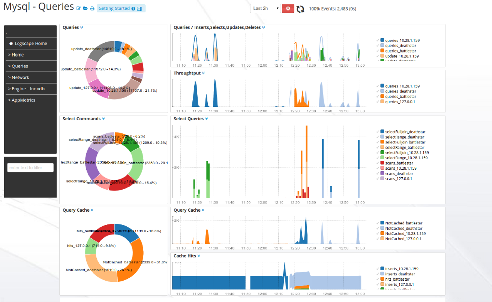
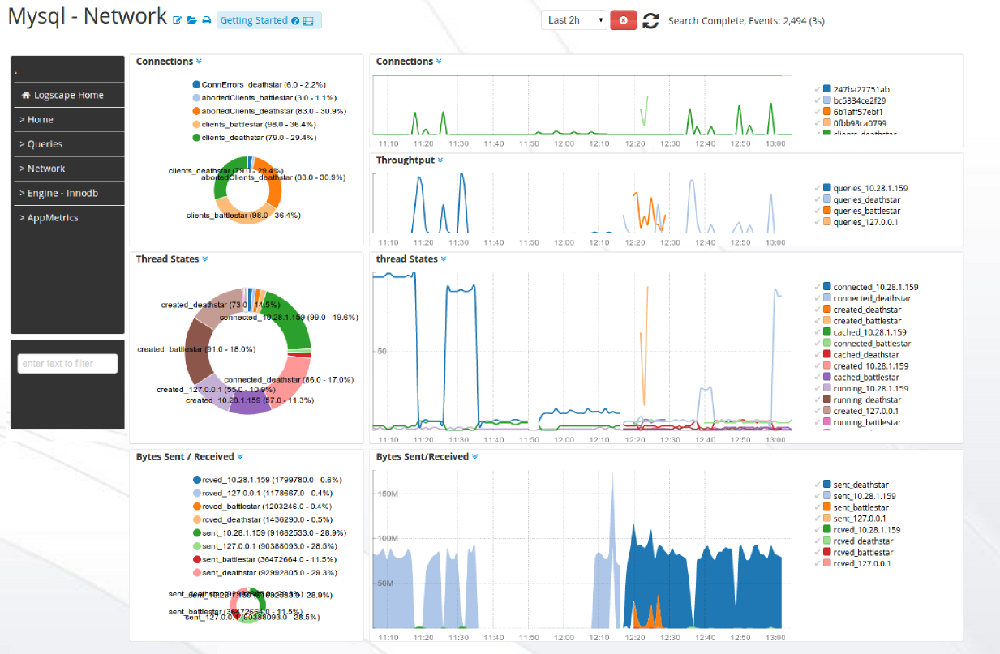

UnixApp-1.1 
===========

The MySQLApp monitors disk,network and system health.

## Prequisites

	* Create a read only user to access the following MySQL commands
		** SHOW GLOBAL VARS
		** SHOW GLOBAL STATUS

	* Give logscape read access to the /var/log/mysql log folder

	* Update the following vars in your properties file 
		** defaultUser, defaultPassword  - the credentials for the read-only mysql user 
		** hostnames -  a comma separated list of mysql hosts to monitor

	* resource selection - the resource selection is optional but it is recommended if you have a large environment 
## Downloads 

 * [MysqlApp-1.1.zip](https://github.com/logscape/mysqlapp/raw/master/dist/MysqlApp-1.1.zip)
 * [Example Properties File ](https://github.com/logscape/mysqlapp/raw/master/dist/MysqlApp-1.1-override.properties)

## Overview

The home page gives you an estate wide view of your servers performance and health. Identify quickly when your servers are struggling under load. 

 

## Queries Activity  

 

## Innodb Stats 

 

## Network Throughput 

 

